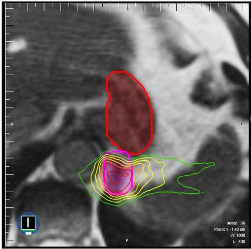

# UW-Madison GI Tract Image Segmentation

[](https://pypi.org/project/zenml/)

## 🎯 Purpose
The aim of this ZenFile is to show you how to use some of ZenML's features to build and deploy production ready machine-learning pipeline. 

By the end you'll learn how to:
- Use ZenML as a framework to develop and ship an image segmentation model.
- Integrating third-party tools like wandb into ZenML.
- Utilizing other features like caching, step operators to speed up your workflow.

## 💡 Introduction
In 2019, an estimated 5 million people were diagnosed with a cancer of the gastro-intestinal tract worldwide.
One of the most common treatments for this type of cancer is by radiation therapy which involves delivering high doses of X-ray beams pointed to the tumors while avoiding the stomach and intestines.

With technologies like MRI, doctors are now able to visualize the position of the tumors, stomach and intestines precisely to deliver the radiation.
But, existing method requires the doctor to manually outline the position of stomach and intestines. 

The image below shows the outlined position of the tumor and stomach.



The tumor is outlined in thick pink line and the stomach in thick red line.
The radiation doses are represented by the rainbow of outlines, with higher doses represented by red and lower doses represented by green.

The outlining procedure is time-consuming and can delay treatment anywhere from 15 minutes to 1 hour every day.
Well, unless we can automate it, with deep learning.

Cancer takes enough of a toll. If successful, we'll enable radiation oncologists to safely deliver higher doses of radiation to tumors while avoiding the stomach and intestines. This will make cancer patients' daily treatments faster and allow them to get more effective treatment with less side effects and better long-term cancer control.

## 🖼 Dataset
We will be segmenting organs cells in images. For that, we'll be using data from [UW-Madison GI Tract Image Segmentation Kaggle Competiton](https://www.kaggle.com/competitions/uw-madison-gi-tract-image-segmentation/data).

The training annotations are provided as RLE-encoded masks, and the images are in 16-bit grayscale PNG format. Training data has several cases for each image, each with different annotations.


## ⚙ Installation
Let's begin setting up by installling necessary Python packages. 

In your terminal, run

```bash
git clone https://github.com/zenml-io/zenfiles.git
cd zenfiles/image-segmentation
pip install -r requirements.txt
```

Let's also install the wandb integration

```bash
zenml integration install -y wandb
```

## 📙 Resources & References

Please read the blog introducing this project in detail: [Segmenting stomach and Intestines in MRI Scan](#).

# :thumbsup: The Solution

To build a model which will segment stomach and intestine from MRI scans & setting this in real-world workflow, we will build a reproducible pipeline using ZenML for this task; we will be using step operators for training on the cloud (I will be using AWS but feel free to choose your favorite cloud provider.), we will also make use of ZenML's wandb integration for experiment tracking.

Our training pipeline `run_image_seg_pipeline.py` will be built using the following steps:-

- `prepare_df`: This step will read the data and prepare it for the pipeline.
- `create_stratified_fold`: This step creates stratified k folds.
- `augment_df`: This step returns a dictionary of data transforms( the transformation we need to apply to our data).
- `prepare_dataloaders`: This step takes in the dataframe, and the data transforms and returns the train and validation dataloaders.
- `initiate_model_and_optimizer`: This step returns (U-Net model, Adam optimizer, Configured scheduler).
- `train_model`: a step that takes the model, optimizer, scheduler, train_loader, and valid_loader and returns the trained model and history.

We need to train the models in a remote environment, so we need to use `StepOperator` to run your training jobs on remote backends. For this project, we will be using sagemaker as our remote backend to run our training jobs. We have several types of `StepOperator,` and each step operator has its own prerequisites. Before running this project, you must set up the individual cloud providers in a certain way. The complete guide for `StepOperators` in the [docs](https://docs.zenml.io/advanced-guide/cloud/step-operators).

Let's first create a sagemaker stack; you can create it by following commands:-

```bash
# install ZenML integrations
zenml integration install aws s3

zenml artifact-store register s3_store \
    --flavor=s3 \
    --path=<S3_BUCKET_PATH>

# create the sagemaker step operator
zenml step-operator register sagemaker \
    --flavor=sagemaker \
    --role=<SAGEMAKER_ROLE> \
    --instance_type=<SAGEMAKER_INSTANCE_TYPE>
    --base_image=<CUSTOM_BASE_IMAGE>
    --bucket_name=<S3_BUCKET_NAME>
    --experiment_name=<SAGEMAKER_EXPERIMENT_NAME>

# register the container registry
zenml container-registry register ecr_registry --flavor=aws --uri=<ACCOUNT_ID>.dkr.ecr.us-east-1.amazonaws.com

# register and activate the sagemaker stack
zenml stack register sagemaker_stack \
    -m default \
    -o default \
    -c ecr_registry \
    -a s3_store \
    -s sagemaker \
    --set
```

If you have other cloud service providers like Azure or GCP, feel free to visit [this example](https://github.com/zenml-io/zenml/tree/main/examples/step_operator_remote_training) for setting up the stack for the different remote backend.

We also need to integrate Weights & Biases tracking into our pipeline; we can create the stack with the wandb experiment tracker component by the following command:

```bash
zenml experiment-tracker register wandb_tracker --type=wandb \
    --api_key=<WANDB_API_KEY> \
    --entity=<WANDB_ENTITY> \
    --project_name=<WANDB_PROJECT_NAME>
```

Now we can register a new stack with our experiment tracker component using the following command:

```bash
zenml stack register sagemaker_stack_with_wandb \
    -m default \
    -o default \
    -c ecr_registry \
    -a s3_store \
    -s sagemaker \
    -e wandb_tracker \
    --set
```

We created a stack named `sagemaker_stack_with_wandb` with the `StepOperator` component as sagemaker, and `wandb` as experiment tracker.

Now you can run the `run_image_seg_pipeline.py` by the following command:

```bash
python run_image_seg_pipeline.py
```
